<p align="center">
  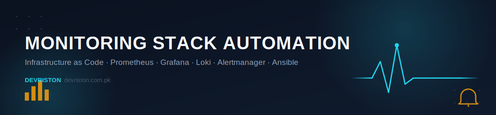
</p>

<h1 align="center">📊 Monitoring Stack Automation</h1>

<p align="center">
  A complete, self-hosted observability platform — Prometheus, Grafana, Loki and Alertmanager —
  provisioned with Vagrant and deployed hands-off with Ansible &amp; Docker Compose.
</p>

<p align="center">
  
  
  
  
  
  
  
</p>

<p align="center">
  <a href="https://devriston.com.pk">
    
  </a>
  <a href="https://www.linkedin.com/in/kamrankabeer/">
    
  </a>
  <a href="https://github.com/muhammadkamrankabeer-oss">
    
  </a>
</p>

---

## 📌 Project Overview

**Monitoring Stack Automation** is a complete observability platform built using Infrastructure as Code (IaC) principles.

The project provisions a Debian 12 virtual machine with **Vagrant**, deploys a full monitoring and logging stack with **Docker Compose**, and automates the entire rollout end-to-end with **Ansible**.

The solution provides:

- 🖥️ Infrastructure monitoring
- 📈 Metrics collection
- 🚨 Alerting
- 📜 Log aggregation
- 📊 Dashboard visualization
- ⚙️ Automated, repeatable deployment

---

## ✨ Features

### 🖥️ Infrastructure Monitoring
- Prometheus metrics collection
- Node Exporter host monitoring
- CPU, memory, disk, and network monitoring

### 🚨 Alerting
- Prometheus alert rules
- Alertmanager integration
- High CPU usage alerts
- Centralized alert management

### 📜 Logging
- Loki log aggregation
- Promtail log collection
- Grafana log exploration

### 📊 Visualization
- Grafana dashboards
- Node Exporter Full Dashboard
- Metrics visualization & log exploration

### ⚙️ Automation
- Vagrant environment provisioning
- Docker Compose deployment
- Ansible automation with a role-based structure

---

## 🏗️ Architecture

```text
Host Machine
     |
     v
Ansible
     |
     v
Vagrant VM (Debian 12)
     |
     v
Docker Engine
     |
     v
Docker Compose
     |
     +---------------------------+
     |                           |
     v                           v
Prometheus                 Alertmanager
     |
     v
Node Exporter

Promtail ---> Loki ---> Grafana
                   ^
                   |
            Prometheus Metrics
```

---

## 🧰 Technology Stack

| Category          | Technology     |
| ------------------ | -------------- |
| Virtualization      | Vagrant        |
| Operating System    | Debian 12      |
| Automation          | Ansible        |
| Container Runtime    | Docker         |
| Orchestration        | Docker Compose |
| Monitoring          | Prometheus     |
| Metrics Exporter    | Node Exporter  |
| Alerting            | Alertmanager   |
| Visualization        | Grafana        |
| Logging              | Loki           |
| Log Collection        | Promtail       |

---

## 📂 Repository Structure

```text
monitoring-stack-automation/
│
├── Vagrantfile
├── README.md
│
├── ansible/
│   ├── inventory/
│   ├── playbooks/
│   └── roles/
│
├── configs/
│   ├── prometheus.yml
│   ├── alertmanager.yml
│   ├── alert_rules.yml
│   ├── loki-config.yml
│   └── promtail-config.yml
│
├── docker/
│   └── docker-compose.yml
│
└── docs/
    ├── banner.svg
    ├── architecture/
    ├── interview/
    └── screenshots/
```

---

## 🚀 Deployment Workflow

### 1️⃣ Start the virtual machine
```bash
vagrant up
```

### 2️⃣ Connect to the virtual machine
```bash
vagrant ssh
```

### 3️⃣ Deploy the stack with Docker Compose
```bash
cd /home/vagrant/monitoring-stack/docker
docker compose up -d
```

### 4️⃣ Or deploy the stack with Ansible
```bash
cd ansible
ansible-playbook playbooks/deploy-monitoring.yml
```

---

## 🌐 Services

| Service       | Port |
| -------------- | ---- |
| Grafana        | 3000 |
| Prometheus     | 9090 |
| Alertmanager   | 9093 |
| Node Exporter  | 9100 |
| Loki           | 3100 |

---

## 📸 Screenshots

### 🐳 Stack Up & Running
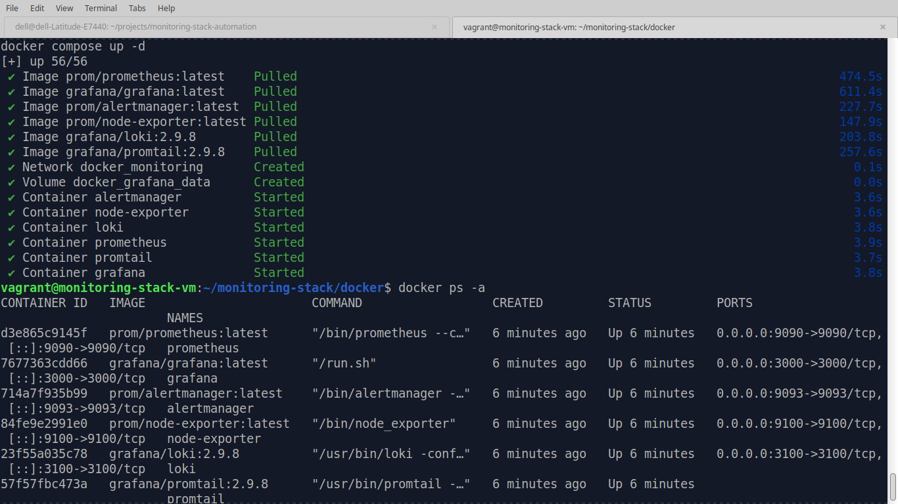

### 🎯 Prometheus Targets
<p>
  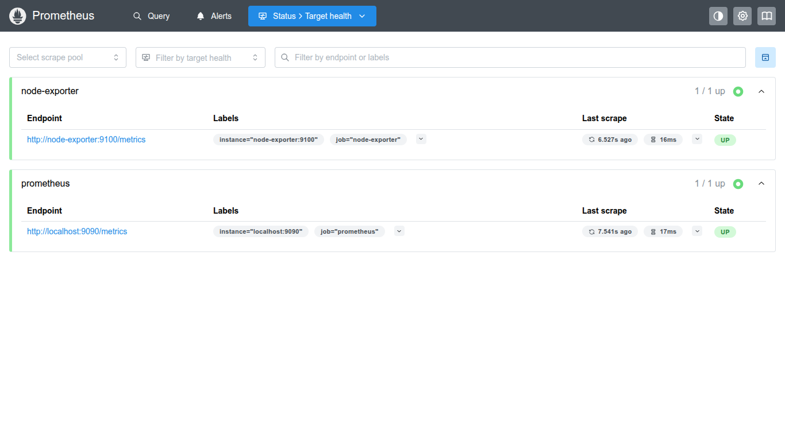
  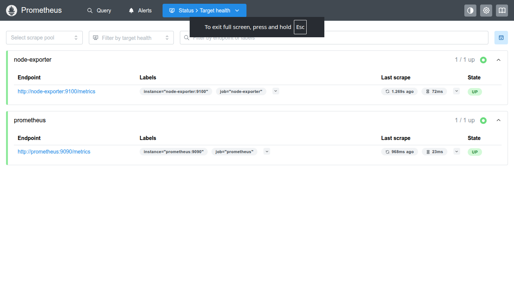
</p>

### 📐 Prometheus Alert Rules
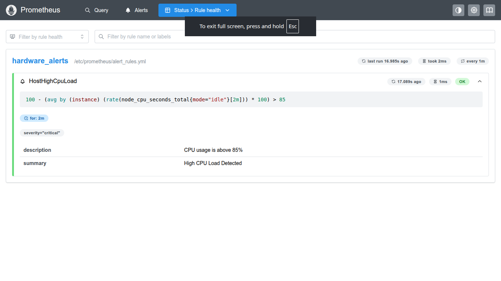

### 🚨 Active Alerts
<p>
  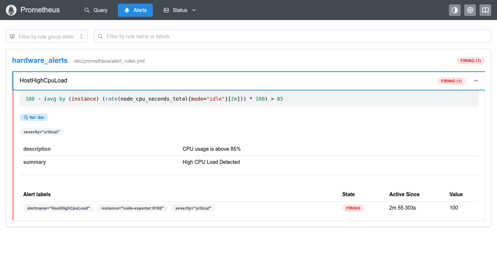
  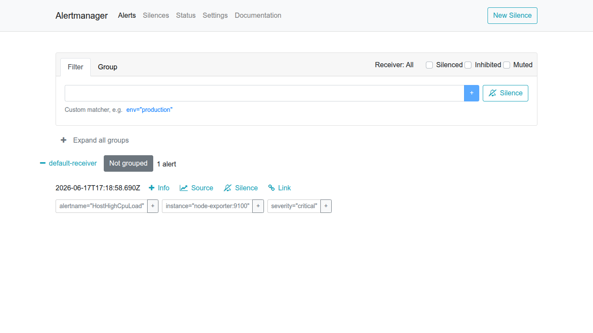
</p>

### 📊 Grafana
<p>
  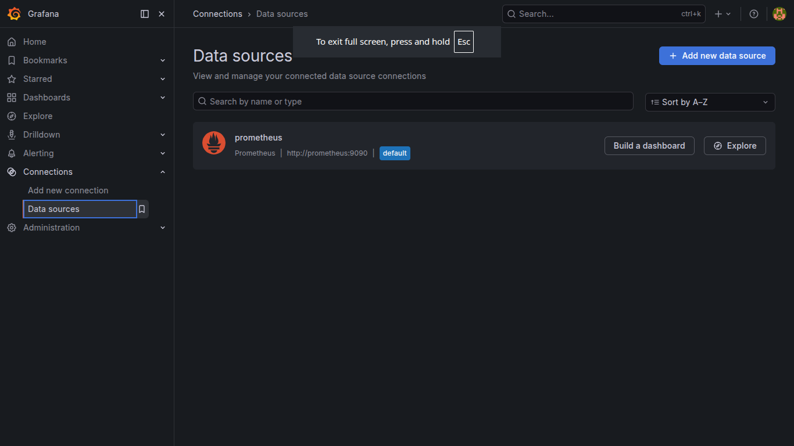
  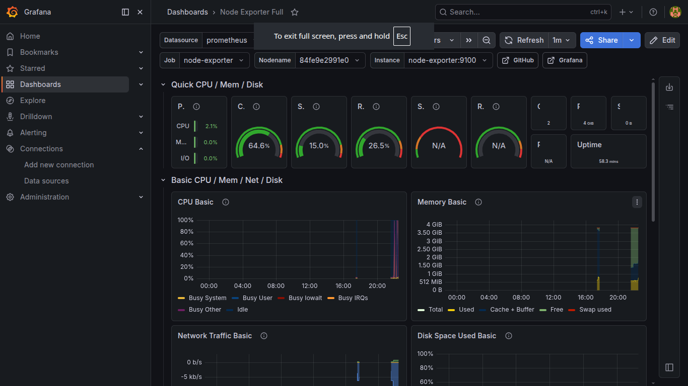
  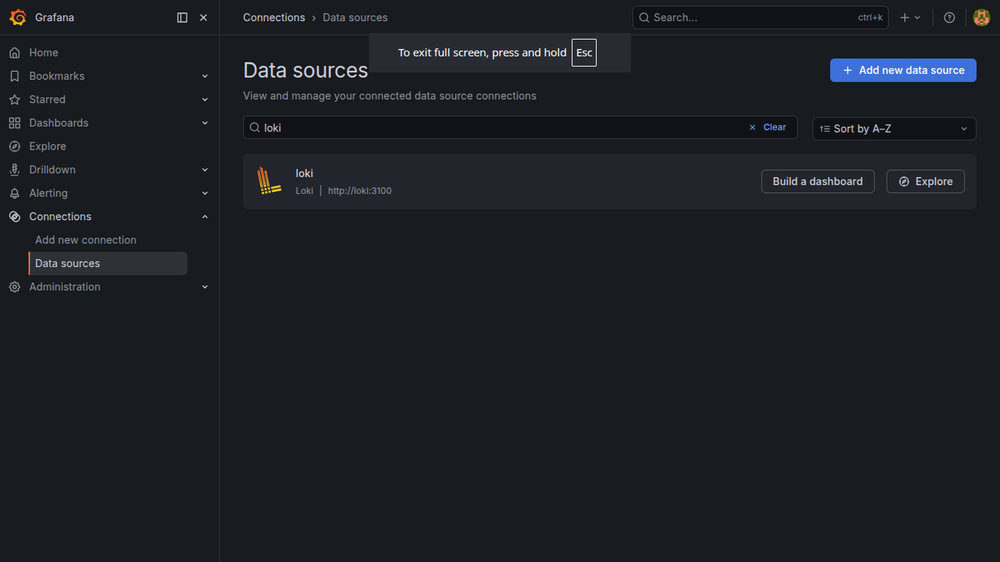
  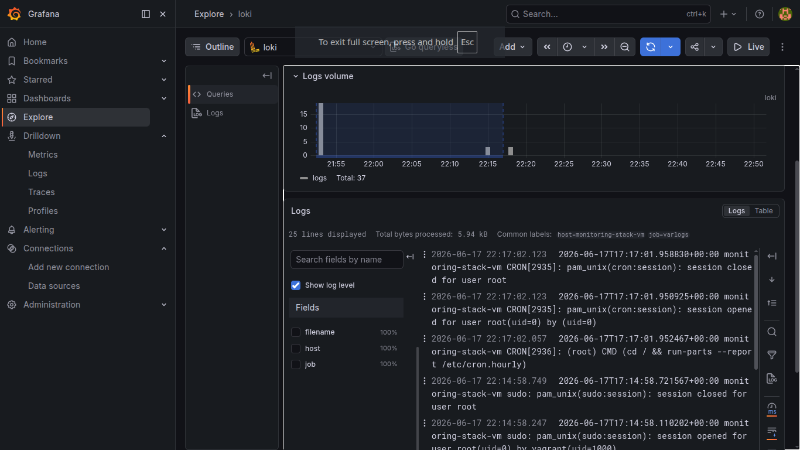
</p>

### ⚙️ Automation
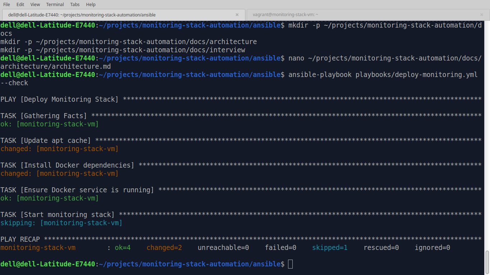

---

## 📖 Documentation

| Doc | Path |
| --- | ---- |
| 🏗️ Architecture notes | [`docs/architecture/architecture.md`](docs/architecture/architecture.md) |
| 🎤 Interview preparation | [`docs/interview/interview.md`](docs/interview/interview.md) |

---

## 🎯 Learning Outcomes

This project demonstrates practical, hands-on experience with:

- Infrastructure as Code
- Monitoring and Observability
- Metrics Collection
- Alerting Workflows
- Centralized Logging
- Docker Containerization
- Ansible Automation
- Vagrant-based Lab Environments
- Linux System Monitoring

---

## 👤 Author

<p align="center">
  <strong>Muhammad Kamran Kabeer</strong><br>
  DevOps | Cloud | Linux | Automation | Observability
</p>

<p align="center">
  <a href="https://devriston.com.pk">
    
  </a>
  <a href="https://www.linkedin.com/in/kamrankabeer/">
    
  </a>
  <a href="https://github.com/muhammadkamrankabeer-oss">
    
  </a>
</p>
